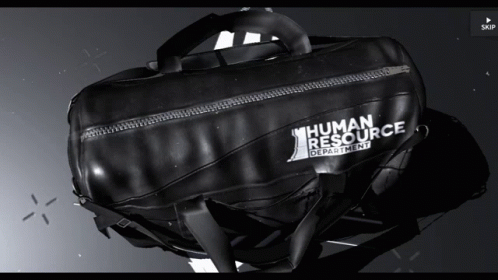
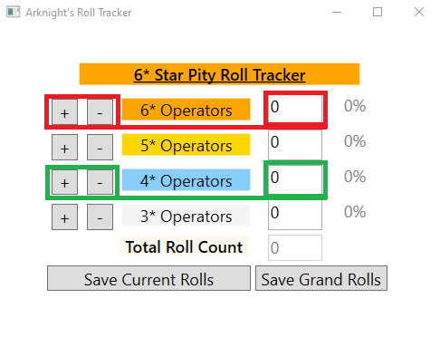
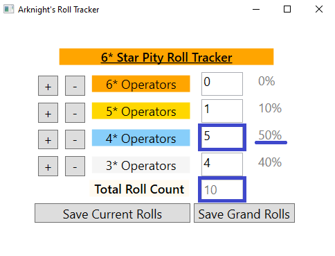
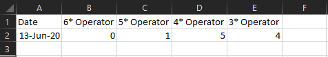

# Arknight_Roll_Tracker

A simple application to keep track of current gacha roll streak up until a six star rarity operator is obtained for the game, Arknight.

	

## How to Install

* Download 'Arknight_Roll_Tracker.zip' and extract folder to a location you wish to keep the application.
* Run the .exe file, 'Arknight_Roll_Tracker.exe'. 
	* If you do not have .NET Core Runtime installed, you will be prompted to install it.
	* Following hyperlink should direct you to Microsoft's .NET Cores download website (Download latest .NET Core Runtime): https://dotnet.microsoft.com/download/dotnet-core/3.1

## Using the Application

	

* Buttons on the left of star rarity labels will increase or decrease the count value by +- 1.
	* Alternatively, count value can be manually inputted in to the textbox.
	

	

* Percentage value (grayed out) on the right of count value textbox is the count value divided by the current total roll visable under star rarity labels.

	

* 'Save Current Rolls' button will write all count values to a csv file located with in the folder.
	* 'Save Grand Rolls' button will do the same in another csv file.
	* These files can be accessed to view the collective data saved since the inital usage of the application.
	
## Credit

I created this application to begin my studies in C# programming language. The application was built with an MVVM model in mind for future functionality implementation. Please feel free to take the code and edit it to your own liking. 

Thank you!
